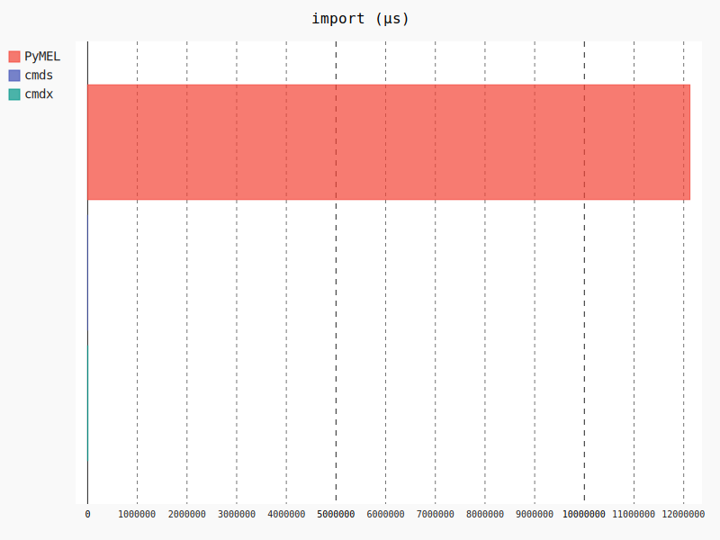
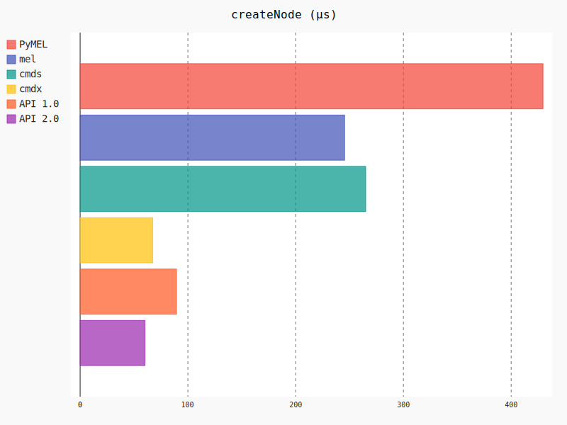
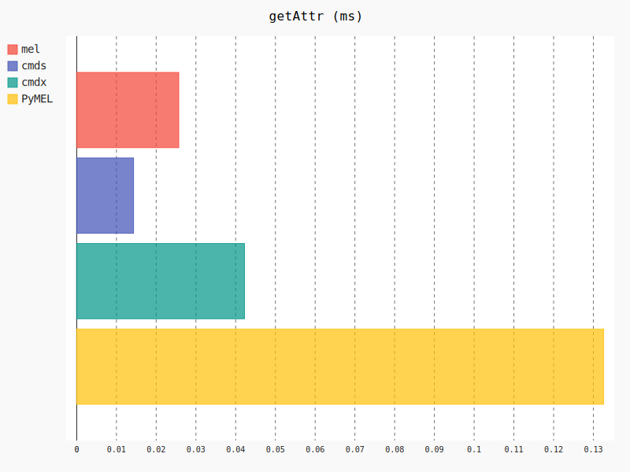
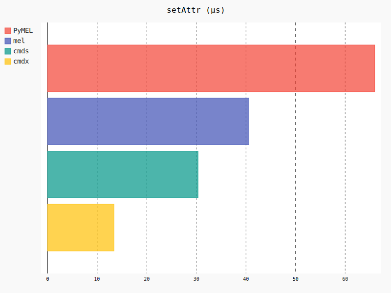
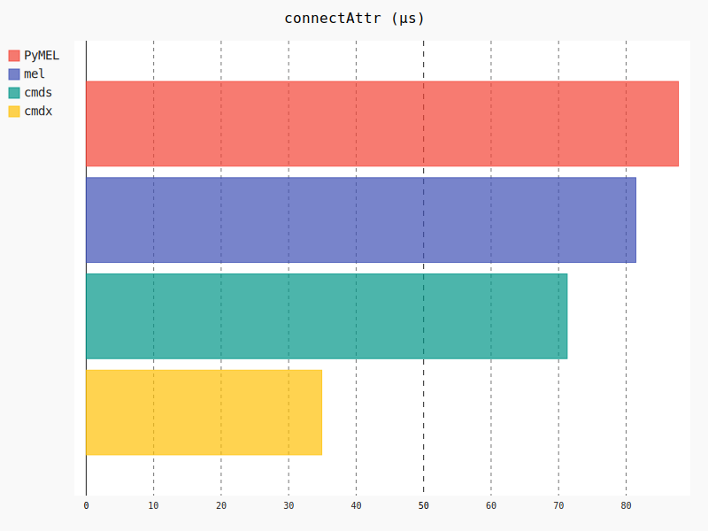
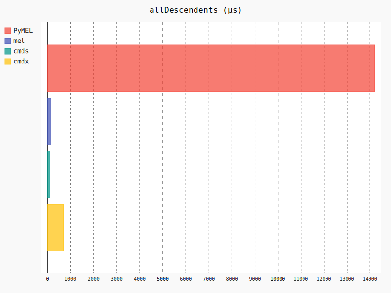
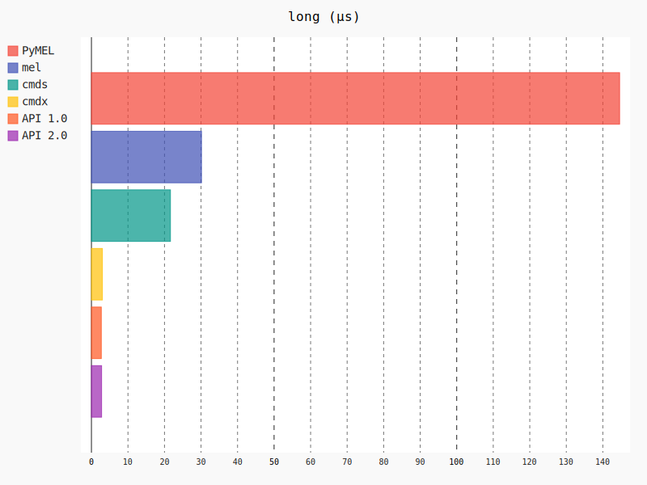
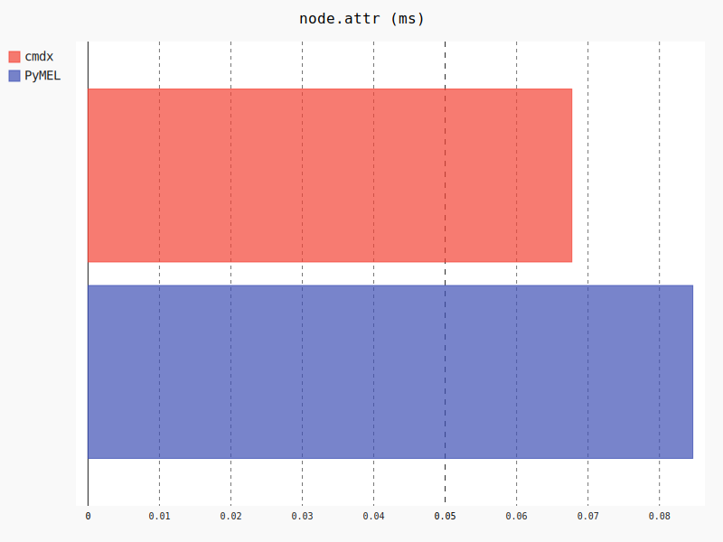
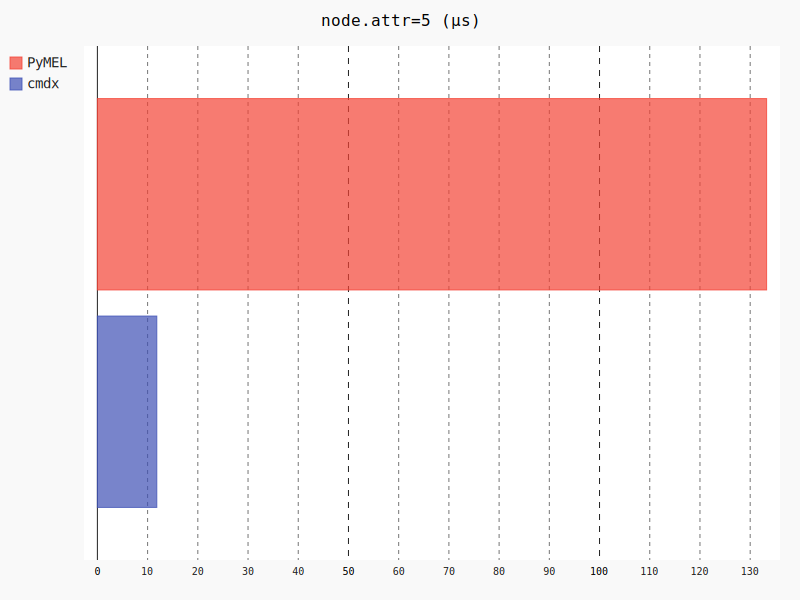

<a href=/cmdx/><p align=center></p></a>

<p align=center>A fast subset of <a href=http://help.autodesk.com/cloudhelp/2018/ENU/Maya-Tech-Docs/CommandsPython/index.html><code>maya.cmds</code></a></p>

<br>

### About

`cmdx` is a Python wrapper for the [Maya Python API 2.0](http://help.autodesk.com/view/MAYAUL/2016/ENU/?guid=__py_ref_index_html) and a fast subset of the `maya.cmds` module, with persistent references to nodes.

If you fit in either of these groups, then `cmdx` is for you.

- You like `cmds`, but wish to type less
- You like `PyMEL`, but wish it was faster

On average, `cmdx` is **140x faster** than [PyMEL](https://github.com/LumaPictures/pymel), and 2.5x faster than `maya.cmds` at common tasks; at best, it is 1,300x faster than PyMEL.

- See [Command Reference](https://mottosso.com/cmdx) for technical details
- See [Measurements](#measurements) and [Timings](#timings) for details
- See `help()` for examples on a particular command, e.g. `help(cmdx.Node)`

##### News

| Date     | Version   | Event
|:---------|:----------|:----------
| Aug 2019 | 0.4.0 | Public release
| Feb 2018 | 0.1.0 | Extracted into its own repository
| Jun 2017 | 0.0.0 | Starts as an internal module

##### Status

[](https://github.com/mottosso/cmdx/)
[](https://pypi.org/project/cmdx)

| Maya | Status
|:----------|:-----
| 2015 | [](https://mottosso.visualstudio.com/cmdx/_build/latest?definitionId=7&branchName=master)
| 2016 | [](https://mottosso.visualstudio.com/cmdx/_build/latest?definitionId=7&branchName=master)
| 2017 | [](https://mottosso.visualstudio.com/cmdx/_build/latest?definitionId=7&branchName=master)
| 2018 | [](https://mottosso.visualstudio.com/cmdx/_build/latest?definitionId=7&branchName=master)
| 2019 | [](https://mottosso.visualstudio.com/cmdx/_build/latest?definitionId=7&branchName=master)
| 2020 | [](https://mottosso.visualstudio.com/cmdx/_build/latest?definitionId=7&branchName=master)

##### Usecases

`cmdx` was written for performance critical run-time tasks in Maya, listening to thousands of events, reading from and writing to thousands of attributes each frame, without affecting user interactivity. It doesn't capture all of `cmds`, but rather a small subset related to parts relevant to these types of performance critical tasks.

| Usecase | Description
|:--------|:------------
| Real-time processing | Such as responding to user input without interruption
| Data intensive processing | Such as processing thousands of attributes on thousands of nodes at once
| Plug-in creation | Provides both superclasses and compatible API for performing most if not all calls in `compute()` or `draw()` using `cmdx`.

<br>

### Install

cmdx is a single file and can either be [copy/pasted](https://raw.githubusercontent.com/mottosso/cmdx/master/cmdx.py) into your project, [downloaded](https://github.com/mottosso/cmdx/archive/master.zip) as-is, cloned as-is or installed via `pip`.

```bash
$ pip install cmdx
```

- Pro tip: **Never use the latest commit for production**. Instead, use [the latest release](https://github.com/mottosso/cmdx/releases). That way, when you read bug reports or make one for yourself you will be able to match a version with the problem without which you will not know which fixes apply to you nor would we be able to help you. Installing via pip or conda as above ensures you are provided the latest *stable* release. Unstable releases are suffixed with a `.b`, e.g. `0.5.0.b1`.

<br>

### What is novel?

With [so many options](#comparison) for interacting with Maya, when or why should you choose `cmdx`?

- [Performance](#performance)
- [Declarative plug-ins](#plug-ins)
- [Node and attribute reuse](#query-reduction)
- [Transactions](#transactions)
- [Hashable References](#hashable-references)
- [Signals](#signals)
- [PEP8 Dual Syntax](#pep8-dual-syntax)

<br>
<br>

**Table of contents**

- [System Requirements](#system-requirements)
- [Syntax](#syntax)
- [Performance](#performance)
- [Goals](#goals)
- [Overhead](#overhead)
- [Query Reduction](#query-reduction)
    - [Node Reuse](#node-reuse)
    - [Plug Reuse](#plug-reuse)
    - [Hashable References](#hashable-references)
    - [Metadata](#metadata)
- [Interoperability](#interoperability)
- [Units](#units)
- [Node Types](#node-types)
- [Node Creation](#node-creation)
- [Attribute Query and Assignment](#attribute-query-and-assignment)
    - [Meta Attributes](#meta-attributes)
    - [Arrays](#arrays)
    - [Cached](#cached)
    - [Time](#time)
    - [Native Types](#native-types)
    - [Contains](#contains)
- [Connections](#connections)
- [Plug-ins](#plug-ins)
    - [Defaults](#defaults)
    - [Draw](#draw)
    - [Compute](#compute)
    - [Manipulators](#manipulators)
- [Iterators](#iterators)
- [Transactions](#transactions)
- [Modifier](#modifier)
- [Signals](#signals)
- [PEP8 Dual Syntax](#pep8-dual-syntax)
- [Comparison](#comparison)
    - [MEL](#mel)
    - [PyMEL](#pymel)
    - [cmds](#cmds)
    - [API 1.0](#api-1-0)
    - [API 2.0](#api-2-0)
    - [MRV](#third-party)
    - [metan](#third-party)
- [YAGNI](#yagni)
- [Timings](#timings)
- [Measurements](#measurements)
    - [Overall Performance](#overall-performance)
    - [`import`](#import)
    - [`createNode`](#createNode)
    - [`getAttr`](#getAttr)
    - [`setAttr`](#setAttr)
    - [`connectAttr`](#connectAttr)
    - [`long`](#long)
    - [`node`](#node-attr-attr)
    - [`ls`](#ls)
- [Evolution](#evolution)
- [FAQ](#faq)
- [Debugging](#debugging)
- [Flags](#flags)
    - [`CMDX_ENABLE_NODE_REUSE`](#cmdx_enable_node_reuse)
    - [`CMDX_ENABLE_PLUG_REUSE`](#cmdx_enable_plug_reuse)
    - [`CMDX_ENABLE_UNDO`](#cmdx_enable_undo)
    - [`CMDX_TIMINGS`](#cmdx_timings)
    - [`CMDX_MEMORY_HOG_MODE`](#cmdx_memory_hog_mode)
    - [`CMDX_IGNORE_VERSION`](#cmdx_ignore_version)
    - [`CMDX_ROGUE_MODE`](#cmdx_rogue_mode)
    - [`CMDX_SAFE_MODE`](#cmdx_safe_mode)
- [References](#references)
- [Notes](#notes)
    - [MDagModifier](#mdagmodifier)
- [Examples](#examples)

<br>

### System Requirements

`cmdx` runs on Maya 2015 SP3 and above (SP2 does *not* work).

It *may* run on older versions too, but those are not being tested. To bypass the version check, see [`CMDX_IGNORE_VERSION`](#cmdx_ignore_version).

<br>

### Syntax

`cmdx` supports the legacy syntax of `maya.cmds`, along with an object-oriented syntax, similar to PyMEL.


**Legacy**

Familiar and fast.

```python
>>> import cmdx
>>> joe = cmdx.createNode("transform", name="Joe")
>>> benji = cmdx.createNode("transform", name="myChild", parent=joe)
>>> cmdx.addAttr(joe, longName="myAttr", defaultValue=5.0, attributeType="double")
>>> cmdx.connectAttr(joe + ".myAttr", benji + ".tx")
>>> cmdx.setAttr(joe + ".myAttr", 5)
>>> cmdx.delete(joe)
```

**Modern**

Faster and most concise.

```python
>>> import cmdx
>>> joe = cmdx.createNode("transform", name="Joe")
>>> benji = cmdx.createNode("transform", name="myChild", parent=joe)
>>> joe["myAttr"] = cmdx.Double(default=5.0)
>>> joe["myAttr"] >> benji["translateX"]
>>> joe["tx"] = 5
>>> cmdx.delete(joe)
```

**Commands**

- `createNode`
- `getAttr`
- `setAttr`
- `addAttr`
- `connectAttr`
- `listRelatives`
- `listConnections`

**Attribute Types**

- `Double`
- `Double3`
- `Enum`
- `String`
- `Angle`
- `Distance`
- `Time`
- `Message`
- `Boolean`
- `Divider`
- `Long`
- `Compound`
- `NurbsCurve`

<br>

### Performance

`cmdx` is fast, faster than `cmds` by 2-5x and PyMEL by 5-150x, because of how it uses the Maya API 2.0, how classes are built and the (efficient) pre-processing happening on import.

See [Measurements](#measurements) for performance statistics and comparisons between MEL, cmds, cmdx, PyMEL, API 1.0 and 2.0.

**How?**

The fastest you can possibly get with Python inside Maya is through the Maya Python API 2.0. `cmdx` is a thin wrapper around this library that provides a more accessible and readable interface, whilst avoiding as much overhead as possible.

<br>

### Goals

With PyMEL as baseline, these are the primary goals of this project, in order of importance.

| Goal            | Description
|:----------------|:-------------
| Readable        | For code that is read more than it is written
| Fast            | Faster than PyMEL, and cmds
| Lightweight     | A single Python module, implementing critical parts well, leaving the rest to `cmds`
| Persistent      | References to nodes do not break
| Do not crash    | Working with low-level Maya API calls make it susceptible to crashes; cmdx should protect against this, without sacrificing performance
| No side effects | Importing `cmdx` has no affect any other module
| External        | Shipped alongside your code, not alongside Maya; you control the version, features and fixes.
| Vendorable      | Embed an appropriate version of `cmdx` alongside your own project
| PEP8            | Continuous integration ensures that every commit follows the consistency of PEP8
| Examples        | No feature is without examples

<br>

### Overhead

`cmdx` tracks node access via a Maya API callback. This callback is called on node destruction and carries an overhead to normal Maya operation when deleting nodes, most noticeably when creating a new scene (as it causes all nodes to be destroyed at once).

In the most extreme circumstance, with 100,000 nodes tracked by `cmdx`, all nodes are destroyed in 4.4 seconds. Without this callback, the nodes are destroyed in 4.3 seconds.

This accounts for an overhead of 1 ms/node destroyed.

This overhead can be bypassed with [Rogue Mode](#cmdx_rogue_mode).

**Test**

To confirm this for yourself, run the below in your Script Editor; it should take about 30-60 seconds depending on your hardware.

```python
# untested
import time
import timeit
import cmdx

import os

def setup():
   for i in range(100000):
     cmdx.createNode("transform")

def rogue():
    os.environ["CMDX_ROGUE_MODE"] = "1"
    cmds.file(new=True, force=True)
    reload(cmdx)
    setup()

def nonrogue():
    os.environ.pop("CMDX_ROGUE_MODE", None)
    cmds.file(new=True, force=True)
    reload(cmdx)
    setup()

t1 = timeit.Timer(
    lambda: cmds.file(new=True, force=True),
    setup=rogue
).repeat(repeat=2, number=2)

t2 = timeit.Timer(
    lambda: cmds.file(new=True, force=True),
    setup=nonrogue
).repeat(repeat=4, number=1)

print("rogue: %.3f ms" % (min(t1) * 1000))
print("nonrogue: %.3f ms" % (min(t2) * 1000))
```

<br>

### Query Reduction

Beyond making queries faster is making less of them.

Any interaction with the Maya API carries the overhead of translating from Python to C++ and, most of the time, back to Python again. So in order to make `cmdx` fast, it must facilitate re-use of queries where re-use makes sense.

#### Node Reuse

Any node created or queried via `cmdx` is kept around until the next time the same node is returned, regardless of the exact manner in which it was queried.

For example, when `encode`d or returned as children of another node.

```python
>>> import cmdx
>>> node = cmdx.createNode("transform", name="parent")
>>> cmdx.encode("|parent") is node
True
```

This property survives function calls too.

```python
>>> import cmdx
>>> from maya import cmds
>>> def function1():
...   return cmdx.createNode("transform", name="parent")
...
>>> def function2():
...   return cmdx.encode("|parent")
...
>>> _ = cmds.file(new=True, force=True)
>>> function1() is function2()
True
```

In fact, regardless of how a node is queried, there is only ever a single instance in `cmdx` of it. This is great for repeated queries to nodes and means nodes can contain an additional level of state, beyond the one found in Maya. A property which is used for, amongst other things, optimising *plug reuse*.

#### Plug Reuse

```python
node = cmdx.createNode("transform")
node["translateX"]  # Maya's API `findPlug` is called
node["translateX"]  # Previously found plug is returned
node["translateX"]  # Previously found plug is returned
node["translateX"]  # ...
```

Whenever an attribute is queried, a number of things happen.

1. An `MObject` is retrieved via string-comparison
2. A relevant plug is found via another string-comparison
3. A value is retrieved, wrapped in a Maya API object, e.g. MDistance
4. The object is cast to Python object, e.g. MDistance to `float`

This isn't just 4 interactions with the Maya API, it's also 3 interactions with the *Maya scenegraph*. An interaction of this nature triggers the propagation and handling of the dirty flag, which in turn triggers a virtually unlimited number of additional function calls; both internally to Maya - i.e. the `compute()` method and callbacks - and in any Python that might be listening.

With module level caching, a repeated query to either an `MObject` or `MPlug` is handled entirely in Python, saving on both time and computational resources.

#### Hashable References

In addition to reusing things internally, you are able to re-use things yourself by using nodes as e.g. keys to dictionaries.

```python
>>> import cmdx
>>> from maya import cmds
>>> _ = cmds.file(new=True, force=True)
>>> node = cmdx.createNode("animCurveTA")
>>> nodes = {node: {"key": "value"}}
>>> for node in cmdx.ls(type="animCurveTA"):
...    assert node in nodes
...    assert nodes[node]["key"] == "value"
...
```

The hash of the node is guaranteed unique, and the aforementioned reuse mechanism ensure that however a node is referenced the same reference is returned.

**Utilities**

Here are some useful utilities that leverages this hash.

```python
>>> import cmdx
>>> node = cmdx.createNode("transform")
>>> node == cmdx.fromHash(node.hashCode)
True
>>> node == cmdx.fromHex(node.hex)
True
```

These tap directly into the dictionary used to maintain references to each `cmdx.Node`. The `hashCode` is the one from `maya.api.OpenMaya.MObjectHandle.hashCode()`, which means that if you have an object from the Maya Python API 2.0, you can fetch the `cmdx` equivalent of it by passing its `hashCode`.

However keep in mind that you can only retrieve nodes that have previously been access by `cmdx`.

```python
from maya.api import OpenMaya as om
import cmdx
fn = om.MFnDagNode()
mobj = fn.create("transform")
handle = om.MObjectHandle(mobj)
node = cmdx.fromHash(handle.hashCode())
assert node is None, "%s should have been None" % node
node = cmdx.Node(mobj)
node = cmdx.fromHash(handle.hashCode())
```

A more robust alternative is to instead pass the `MObject` directly.

```python
from maya.api import OpenMaya as om
import cmdx
fn = om.MDagNode()
mobj = fn.create("transform")
node = cmdx.Node(mobj)
```

This will use the hash if a `cmdx` instance of this `MObject` already exist, else it will instantiate a new. The performance difference is slim and as such this is the recommended approach. The exception is if you happen to already has either an `MObjectHandle` or a corresponding `hashCode` at hand, in which case you can save a handful of cycles per call by using `fromHash` or `fromHex`.

<br>

### Metadata

For persistent metadata, one practice is to use a Maya `string` attribute and store arbitrary data there, serialised to string.

For transient metadata however - data that doesn't need or should persist across sessions - you can rely on the node reuse mechanism of `cmdx`.

```python
# Get reference to existing node
node = cmdx.encode("|myNode")

node.data["myData"] = {
  "awesome": True
}
```

This data is then preserved with the node for its lifetime. Once the node is destroyed - e.g. on deleting it or opening a new scene - the data is destroyed along with it.

The data is stored entirely in Python so there is no overhead of interacting with the Maya scenegraph per call or edit.

To make persistent data, you may for example associate a given ID with a file on disk or database path and automatically load the data into it on node creation.

```python
...
```

<br>

### Interoperability

`cmdx` complements `cmds`, but does not replace it.

Commands such as `menuItem`, `inViewMessage` and `move` are left out and considered a convenience; not sensitive to performance-critical tasks such as generating nodes, setting or connecting attributes etc.

Hence interoperability, where necessary, looks like this.

```python
from maya import cmds
import cmdx

group = cmds.group(name="group", empty=True)
cmds.move(group, 0, 50, 0)
group = cmdx.encode(group)
group["rotateX", cmdx.Radians] = 3.14
cmds.select(cmdx.decode(group))
```

An alternative to `cmdx.decode` is to simply cast it to `str`, which will convert a `cmdx` node into the equivalent shortest path.

```python
cmds.select(str(group))
```

Another aspect of `cmdx` that differ from `cmds` is the number arguments to functions, such as `listConnections` and `ls`.

```python
from maya import cmds
import cmdx

node = cmdx.createNode("transform")
cmds.listConnections(str(node), source=True)
cmdx.listConnections(str(node), source=True)
TypeError: listConnections() got an unexpected keyword argument 'source'
```


The reason for this limitation is because the functions `cmds`

- Submit an [issue](issues) or [pull-request](#fork) with commands you miss.

<br>

### Units

`cmdx` takes and returns values in the units used by the UI. For example, Maya's default unit for distances, such as `translateX` is in Centimeters.

```python
import cmdx

node = cmdx.createNode("transform")
node["translateX"] = 5
node["translateX"]
# 5
```

To return `translateX` in Meters, you can pass in a unit explicitly.

```python
node["translateX", cmdx.Meters]
# 0.05
```

To set `translateX` to a value defined in Meters, you can pass that explicitly too.

```python
node["translateX", cmdx.Meters] = 5
```

Or use the alternative syntax.

```python
node["translateX"] = cmdx.Meters(5)
```

The following units are currently supported.

- Angular
  - `Degrees`
  - `Radians`
  - `AngularMinutes`
  - `AngularSeconds`
- Linear
  - `Millimeters`
  - `Centimeters`
  - `Meters`
  - `Kilometers`
  - `Inches`
  - `Feet`
  - `Miles`
  - `Yards`

#### Exceptions

Not all attribute editing supports units.

```python
transform = cmdx.createNode("transform")
tm = transform["worldMatrix"][0].asTransformationMatrix()

# What unit am I?
tm.translation()
```

The same applies to orientation.

```python
tm.rotation()
```

In circumstances without an option, cmdx takes and returns a default unit per type of plug, similar to `maya.api`

**Defaults**

| Type     | Unit
|---------:|:-----
| Linear   | Centimeter
| Angular  | Radian
| Time     | Second

<br>

### Limitations

All of this performance is great and all, but why hasn't anyone thought of this before? Are there no consequences?

I'm sure someone has, and yes there are.

#### Undo

With every command made through `maya.cmds`, the undo history is populated such that you can undo a *block* of commands all at once. `cmdx` doesn't do this, which is how it remains fast, but also less capable of undoing.

For undo, you've got two options.

1. Use [`cmdx.DagModifier`](#modifier) or [`cmdx.DGModifier`](#modifier) for automatic undo of whatever to create or edit using these modifiers
2. Use [`cmdx.commit`](https://mottosso.com/cmdx/#cmdx.commit) for manual control over what happens when the user tries to undo

```py
node = cmdx.createNode("transform")
```

This operation is undoable, because under the hood it calls `cmdx.DagModifier`.

```py
node["translateX"] = 5
node["tx"] >> node["ty"]
```

These operations however is *not* undoable.

In order to edit attributes with support for undo, you must use either a modifier or call `commit`. This is how the Maya API normally works, for both Python and C++.

```py
with cmdx.DagModifier() as mod:
    mod.setAttr(node["translateX"], 5)
    mod.connect(node["tx"], node["ty"])
```

Alternatively, call `commit`.

```py
previous_value = node["translateX"].read()

def my_undo():
    node["translateX"] = previous_value
    node["ty"].disconnect()

node["translateX"] = 5
node["tx"] >> node["ty"]
cmdx.commit(my_undo)
```

Typically, you should prefer to use a modifier as it will manage previous values for you and ensure things are undone in the right order (e.g. no need to undo attribute changes if the node is deleted).

<br>

### Undo Caveats

With this level of control, you are able to put Maya in a bad state.

```py
a = cmdx.encode("existingNode")
b = cmdx.createNode("transform", name="newNode")
b["ty"] >> a["tx"]
```

Here, we are creating a new node and connecting it to `a`. As mentioned, connections are not undoable, so what do you think will happen when the user undos?

1. `newNode` is deleted
2. Connections are preserved

But how can that be? What is `a["tx"]` connected to?! You'll find that the channel is locked and connected, but the connected node is unselectable and yet visible in odd places like the Node Editor but not Outliner.

To address this, make sure that you include anything related to a block of operations in a modifier or `commit`. It can be multiple modifiers, that is fine, they will undo together en masse.

```py
a = cmdx.encode("existingTransform")

with cmdx.DagModifier() as mod:
    b = mod.createNode("transform")
    mod.connect(b["ty"], a["tx"])
```

The user can now undo safely.

<br>

#### Crashes

If this happens to you, please report it along with a reproducible as that would qualify as a bug!

<br>

### Node Creation

Nodes are created much like with `maya.cmds`.

```python
import cmdx
cmdx.createNode("transform")
```

For a 5-10% performance increase, you may pass type as an object rather than string.

```python
cmdx.createNode(cmdx.tTransform)
```

Only the most commonly used and performance sensitive types are available as explicit types.

- `tAddDoubleLinear`
- `tAddMatrix`
- `tAngleBetween`
- `tMultMatrix`
- `tAngleDimension`
- `tBezierCurve`
- `tBlendShape`
- `tCamera`
- `tChoice`
- `tChooser`
- `tCondition`
- `tTransform`
- `tTransformGeometry`
- `tWtAddMatrix`

<br>

### Node Types

Unlike PyMEL and for best performance, `cmdx` does not wrap each node type in an individual class. However it does wrap those with a corresponding API function set.

| Node Type        | Features
|:-----------------|:-------------
| `Node`           | Lowest level superclass, this host most of the functionality of `cmdx`
| `DagNode`        | A subclass of `Node` with added functinality related to hierarchy
| `ObjectSet`      | A subclass of `Node` with added functinality related to sets

#### `Node`

Any node that isn't a `DagNode` or `ObjectSet` is wrapped in this class, which provides the basic building blocks for manipulating nodes in the Maya scenegraph, including working with attributes and connections.

```python
import cmdx
add = cmdx.createNode("addDoubleLinear")
mult = cmdx.createNode("multDoubleLinear")
add["input1"] = 1
add["input2"] = 1
mult["input1"] = 2
mult["input2"] << add["output"]
assert mult["output"] == 4
```

#### `DagNode`

Any node compatible with the `MFnDagNode` function set is wrapped in this class and faciliates a parent/child relationship.

```python
import cmdx
parent = cmdx.createNode("transform")
child = cmdx.createNode("transform")
parent.addChild(child)
```

#### `ObjectSet`

Any node compatible with the `MFnSet` function set is wrapped in this class and provides a Python list-like interface for working with sets.

```python
import cmdx
objset = cmdx.createNode("objectSet")
member = cmdx.createNode("transform")
objset.append(member)

for member in objset:
  print(member)
```

> NOTE: `MFnSet` was first introduced to the Maya Python API 2.0 in Maya 2016 and has been backported to work with `cmdx` in Maya 2015, leveraging the equivalent functionality found in API 1.0. It does however mean that there is a performance impact in Maya <2016 of roughly 0.01 ms/node.

<br>

### Attribute Query and Assignment

Attributes are accessed in a dictionary-like fashion.

```python
import cmdx
node = cmdx.createNode("transform")
node["translateX"]
# 0.0
```

Evaluation of an attribute is delayed until the very last minute, which means that if you don't *read* the attribute, then it is only accessed and not evaluated and cast to a Python type.

```python
attr = node["rx"]
```

The resulting type of an attribute is `cmdx.Plug`

```python
type(attr)
# <class 'cmdx.Plug'>
```

Which has a number of additional methods for query and assignment.

```python
attr.read()
# 0.0
attr.write(1.0)
attr.read()
# 1.0
```

`attr.read()` is called when printing an attribute.

```python
print(attr)
# 1.0
```

For familiarity, an attribute may also be accessed by string concatenation.

```python
attr = node + ".tx"
```

#### Meta Attributes

Attributes about attributes, such as `keyable` and `channelBox` are native Python properties.

```python
import cmdx
node = cmdx.createNode("transform")
node["translateX"].keyable = False
node["translateX"].channelBox = True
```

These also have convenience methods for use where it makes sense for readability.

```python
# Hide from Channel Box
node["translateX"].hide()
```

#### Arrays

Working with arrays is akin to the native Python list.

```python
node = createNode("transform")
node["myArray"] = Double(array=True)
node["myArray"].append(1.0)  # Explicit append
node["myArray"].extend([2.0, 3.0])  # Explicit extend
node["myArray"] += 6.0  # Append via __iadd__
node["myArray"] += [1.1, 2.3, 999.0]  # Append multiple values
```

#### Cached

Sometimes, a value is queried when you know it hasn't changed since your last query. By passing `cmdx.Cached` to any attribute, the previously computed value is returned, without the round-trip the the Maya API.

```python
import cmdx
node = cmdx.createNode("transform")
node["tx"] = 5
assert node["tx"] == 5
node["tx"] = 10
assert node["tx", cmdx.Cached] == 5
assert node["tx"] == 10
```

Using `cmdx.Cached` is a lot faster than recomputing the value, sometimes by several orders of magnitude depending on the type of value being queried.

#### Animation

Assigning a dictionary to any numerical attribute turns those values into animation, with an appropriate curve type.

```py
node = createNode("transform")
node["translateX"] = {1: 0.0, 5: 1.0, 10: 0.0}      # animCurveTL
node["rotateX"] = {1: 0.0, 5: 1.0, 10: 0.0}         # animCurveTA
node["scaleX"] = {1: 0.0, 5: 1.0, 10: 0.0}          # animCurveTL
node["visibility"] = {1: True, 5: False, 10: True}  # animCurveTU

# Alternatively
node["v"].animate({1: False, 5: True, 10: False})
```

Where the `key` is the frame number (can be fractional) and `value` is the value at that frame. Interpolation is `cmdx.Linear` per default, but can be customised with..

```py
node["rotateX"].animate({1: 0.0, 5: 1.0, 10: 0.0}, cmdx.Smooth)
```

Currently available options:

- `cmdx.Stepped`
- `cmdx.Linear`
- `cmdx.Smooth`

Animation is *undoable* if used with a modifier.

```py
with cmdx.DagModifier() as mod:
    node = mod.createNode("transform")
    node["tx"] = {1: 0.0, 2: 5.0}
```

#### Time

The `time` argument of `cmdx.getAttr` enables a query to yield results relative a specific point in time. The `time` argument of `Plug.read` offers this same convenience, only faster.

```python
import cmdx
from maya import cmds
node = cmdx.createNode("transform")

# Make some animation
node["tx"] = {1: 0.0, 50: 10.0, 100: 0.0}

# Query it
node = cmdx.create_node("transform")
node["tx"] << tx["output"]
node["tx"].read(time=50)
# 10.0
```

In Maya 2018 and above, `Plug.read` will yield the result based on the current evaluation context. Following on from the previous example.

```python
from maya.api import OpenMaya as om

context = om.MDGContext(om.MTime(50, unit=om.MTime.uiUnit()))
context.makeCurrent()
node["tx"].read() # Evaluates the context at frame 50
# 10.0
om.MDGContext.kNormal.makeCurrent()
```

The `cmdx.DGContext` class is also provided to make evaluating the DG in another context simpler. When used as a context manager it will set the current context then restore the previous context upon completion.

```python
with cmdx.DGContext(50):
    node["tx"].read()
```

<br>

### Compound and Array Attributes

These both have children, and are accessed like a Python list.

```python
node = cmdx.createNode("transform")
decompose = cmdx.createNode("decomposeMatrix")
node["worldMatrix"][0] >> decompose["inputMatrix"]
```

Array attributes are created by an additional argument.

```python
node = cmdx.createNode("transform")
node["myArray"] = cmdx.Double(array=True)
```

Compound attributes are created as a group.

```python
node = cmdx.createNode("transform")
node["myGroup"] = cmdx.Compound(children=(
  cmdx.Double("myGroupX")
  cmdx.Double("myGroupY")
  cmdx.Double("myGroupZ")
))
```

Both array and compound attributes can be written via index or tuple assignment.

```python
node["myArray"] = (5, 5, 5)
node["myArray"][1] = 10
node["myArray"][2]
# 5
```

<br>

### Matrix Attributes

Create and edit matrix attributes like any other attribute.

For example, here's how you can store a copy of the current worldmatrix of any given node.

```py
import cmdx

node = cmdx.createNode("transform")
node["translate"] = (1, 2, 3)
node["rotate", cmdx.Degrees] = (20, 30, 40)

# Create a new matrix attribute
node["myMatrix"] = cmdx.Matrix()

# Store current world matrix in this custom attribute
node["myMatrix"] = node["worldMatrix"][0].asMatrix()
```

<br>

### Native Types

Maya boasts a library of classes that provide mathematical convenience functionality, such as rotating a vector, multiplying matrices or converting between Euler degrees and Quaternions.

You can access these classes via the `.as*` prefix of `cmdx` instances.

```python
import cmdx
nodeA = cmdx.createNode("transform")
nodeB = cmdx.createNode("transform", parent=nodeA)
nodeC = cmdx.createNode("transform")

nodeA["rotate"] = (4, 8, 15)

tmA = nodeB["worldMatrix"][0].asTransformationMatrix()
nodeC["rotate"] = tmA.rotation()
```

Now `nodeC` will share the same *worldspace* orientation as `nodeA` (note that `nodeB` was not rotated).

##### Matrix Multiplication

One useful aspect of native types is that you can leverage their operators, such as multiplication.

```python
matA = nodeA["worldMatrix"][0].asMatrix()
matB = nodeB["worldInverseMatrix"][0].asMatrix()
tm = cmdx.TransformationMatrix(matA * matB)
relativeTranslate = tm.translation()
relativeRotate = tm.rotation()
```

##### Vector Operations

Maya's `MVector` is exposed as `cmdx.Vector`.

```python
from maya.api import OpenMaya as om
import cmdx

vec = cmdx.Vector(1, 0, 0)

# Dot product
vec * cmdx.Vector(0, 1, 0) == 0.0

# Cross product
vec ^ cmdx.Vector(0, 1, 0) == om.MVector(0, 0, 1)
```

##### EulerRotation Operations

Maya's `MEulerRotation` is exposed as `cmdx.EulerRotation` and `cmdx.Euler`

##### TransformationMatrix Operations

Maya's `MTransformationMatrix` is exposed as `cmdx.TransformationMatrix`, `cmdx.Transform` and `cmdx.Tm`.

Editing the `cmdx` version of a Tm is meant to be more readable and usable in maths operations.

```python
import cmdx
from maya.api import OpenMaya as om

# Original
tm = om.MTransformationMatrix()
tm.setTranslation(om.MVector(0, 0, 0))
tm.setRotation(om.MEulerRotation(cmdx.radians(90), 0, 0, cmdx.kXYZ))

# cmdx
tm = cmdx.Tm()
tm.setTranslation((0, 0, 0))
tm.setRotation((90, 0, 0))
```

In this example, `cmdx` assumes an `MVector` on passing a tuple, and that when you specify a rotation you intended to use the same unit as your UI is setup to display, in most cases degrees.

In addition to the default methods, it can also do multiplication of vectors, to e.g. transform a point into the space of a given transform.

```python
import cmdx

tm = cmdx.TransformationMatrix()
tm.setTranslation((0, 0, 0))
tm.setRotation((90, 0, 0))

pos = cmdx.Vector(0, 1, 0)

# Move a point 1 unit in Y, as though it was a child
# of a transform that is rotated 90 degrees in X,
# the resulting position should yield Z=1
newpos = tm * pos
assert newpos == cmdx.Vector(0, 0, 1)
```

##### Quaternion Operations

Maya's `MQuaternion` is exposed via `cmdx.Quaternion`

In addition to its default methods, it can also do multiplication with a vector.

```python
q = Quaternion(0, 0, 0, 1)
v = Vector(1, 2, 3)
assert isinstance(q * v, Vector)
```

##### Available types

- `asDouble()` -> `float`
- `asMatrix()` -> `MMatrix`
- `asTransformationMatrix()` (alias `asTm()`) -> `MTransformationMatrix`
- `asQuaternion()` -> `MQuaternion`
- `asVector` -> `MVector`

<br>

### Query

Filter children by a search query, similar to MongoDB.

```python
cmds.file(new=True, force=True)
a = createNode("transform", "a")
b = createNode("transform", "b", parent=a)
c = createNode("transform", "c", parent=a)

b["bAttr"] = Double(default=5)
c["cAttr"] = Double(default=12)

# Return children with this attribute only
a.child(query=["bAttr"]) == b
a.child(query=["cAttr"]) == c
a.child(query=["noExist"]) is None

# Return children with this attribute *and value*
a.child(query={"bAttr": 5}) == b
a.child(query={"bAttr": 1}) is None

# Search with multiple queries
a.child(query={
  "aAttr": 12,
  "visibility": True,
  "translateX": 0.0,
}) == b
```

<br>

### Contains

Sometimes, it only makes sense to query the children of a node for children with a shape of a particular type. For example, you may only interested in children with a shape node.

```python
import cmdx

a = createNode("transform", "a")
b = createNode("transform", "b", parent=a)
c = createNode("transform", "c", parent=a)
d = createNode("mesh", "d", parent=c)

# Return children with a `mesh` shape
assert b.child(contains="mesh") == c

# As the parent has children, but none with a mesh
# the below would return nothing.
assert b.child(contains="nurbsCurve") != c
```

<br>

### Geometry Types

`cmdx` supports reading and writing of geometry attributes via the `*Data` family of functions.

**Drawing a line**

```python
import cmdx

parent = cmdx.createNode("transform")
shape = cmdx.createNode("nurbsCurve", parent=parent)
shape["cached"] = cmdx.NurbsCurveData(points=((0, 0, 0), (0, 1, 0), (0, 2, 0)))
```

This creates a new `nurbsCurve` shape and fills it with points.

**Drawing an arc**

Append the `degree` argument for a smooth curve.

```python
import cmdx

parent = cmdx.createNode("transform")
shape = cmdx.createNode("nurbsCurve", parent=parent)
shape["cached"] = cmdx.NurbsCurveData(
    points=((0, 0, 0), (1, 1, 0), (0, 2, 0)),
    degree=2
)
```

**Drawing a circle**

Append the `form` argument for closed loop.

```python
import cmdx

parent = cmdx.createNode("transform")
shape = cmdx.createNode("nurbsCurve", parent=parent)
shape["cached"] = cmdx.NurbsCurveData(
    points=((0, 0, 0), (1, 1, 0), (0, 2, 0)),
    degree=2,
    form=cmdx.kClosed
)
```

<br>

### Connections

Connect one attribute to another with one of two syntaxes, whichever one is the most readable.

```python
a, b = map(cmdx.createNode, ("transform", "camera"))

# Option 1
a["translateX"] >> b["translateX"]

# Option 2
a["translateY"].connect(b["translateY"])
```

Legacy syntax is also supported, and is almost as fast - the overhead is one additional call to `str.strip`.

```python
cmdx.connectAttr(a + ".translateX", b + ".translateX")
```

<br>

### Plug-ins

`cmdx` is fast enough for use in `draw()` and `compute()` of plug-ins.

**Usage**

```py
import cmdx

class MyNode(cmdx.DgNode):
    name = "myNode"
    typeid = cmdx.TypeId(0x85005)

initializePlugin2 = cmdx.initialize2(MyNode)
uninitializePlugin2 = cmdx.uninitialize2(MyNode)
```

Simply save this file to e.g. `myNode.py` and load it from within Maya like this.

```py
from maya import cmds
cmds.loadPlugin("/path/to/myNode.py")
cmds.createNode("myNode")
```

**See also:**

- [Examples](https://github.com/mottosso/cmdx/tree/master/examples)

**Available superclasses:**

- `cmdx.DgNode`
- `cmdx.SurfaceShape`
- `cmdx.SurfaceShapeUI`
- `cmdx.LocatorNode`

**Keep in mind**

- Don't forget to `cmds.unloadPlugin` before loading it anew
- Every Maya node **requires** a *globally unique* "TypeId"
- You can register your own series of IDs for free, [here](https://mayaid.autodesk.io/)
- Try **not to undo** the creation of your custom node, as you will be unable to unload it without restarting Maya
- If two nodes with the same ID exists in the same scene, Maya may crash and will be unable to load the file (if you are even able to save it)
- The `2` refers to Maya API 2.0, which is the default API used by `cmdx`. You can alternatively define a variable or function called `maya_useNewAPI` and use `initializePlugin` without the suffix `2`.
- See the [Maya API Documentation](https://help.autodesk.com/view/MAYAUL/2017/ENU/?guid=__py_ref_class_open_maya_u_i_1_1_m_px_locator_node_html) for superclass documentation, these are merely aliases for the original node types, without the prefix `M`.

<br>

#### Declarative

`cmdx` comes with a *declarative* method of writing Maya plug-ins. "Declarative" means that rather than writing instructions for your plug-in, you write a description of it.

**Before**

```python
from maya.api import OpenMaya as om

class MyNode(om.MPxNode):
    name = "myNode"
    typeid = om.MTypeId(0x85006)

    @staticmethod
    def initializer():
        tAttr = om.MFnTypedAttribute()

        MyNode.myString = tAttr.create(
            "myString", "myString", om.MFnData.kString)
        tAttr.writable = True
        tAttr.storable = True
        tAttr.hidden = True
        tAttr.array = True

        mAttr = om.MFnMessageAttribute()
        MyNode.myMessage = mAttr.create("myMessage", "myMessage")
        mAttr.writable = True
        mAttr.storable = True
        mAttr.hidden = True
        mAttr.array = True

        xAttr = om.MFnMatrixAttribute()
        MyNode.myMatrix = xAttr.create("myMatrix", "myMatrix")
        xAttr.writable = True
        xAttr.storable = True
        xAttr.hidden = True
        xAttr.array = True

        uniAttr = om.MFnUnitAttribute()
        MyNode.currentTime = uniAttr.create(
            "currentTime", "ctm", om.MFnUnitAttribute.kTime, 0.0)

        MyNode.addAttribute(MyNode.myString)
        MyNode.addAttribute(MyNode.myMessage)
        MyNode.addAttribute(MyNode.myMatrix)
        MyNode.addAttribute(MyNode.currentTime)

        MyNode.attributeAffects(MyNode.myString, MyNode.myMatrix)
        MyNode.attributeAffects(MyNode.myMessage, MyNode.myMatrix)
        MyNode.attributeAffects(MyNode.currentTime, MyNode.myMatrix)

```

**After**

Here is the equivalent plug-in, written with `cmdx`.

```python
import cmdx

class MyNode(cmdx.DgNode):
    name = "myNode"
    typeid = cmdx.TypeId(0x85006)

    attributes = [
        cmdx.String("myString"),
        cmdx.Message("myMessage"),
        cmdx.Matrix("myMatrix"),
        cmdx.Time("myTime", default=0.0),
    ]

    affects = [
        ("myString", "myMatrix"),
        ("myMessage", "myMatrix"),
        ("myTime", "myMatrix"),
    ]
```

#### Defaults

Defaults can either be specified as an argument to the attribute, e.g. `cmdx.Double("MyAttr", default=5.0)` or in a separate dictionary.

This can be useful if you need to synchronise defaults between, say, a plug-in and external physics simulation software and if you automatically generate documentation from your attributes and need to access their defaults from another environment, such as sphinx.

```python
import cmdx
import external_library

class MyNode(cmdx.DgNode):
    name = "myNode"
    typeid = cmdx.TypeId(0x85006)

    defaults = external_library.get_defaults()

    attributes = [
        cmdx.String("myString"),
        cmdx.Message("myMessage"),
        cmdx.Matrix("myMatrix"),
        cmdx.Time("myTime"),
    ]

```

Where `defaults` is a plain dictionary.

```python
import cmdx


class MyNode(cmdx.DgNode):
    name = "myNode"
    typeid = cmdx.TypeId(0x85006)

    defaults = {
        "myString": "myDefault",
        "myTime": 1.42,
    }

    attributes = [
        cmdx.String("myString"),
        cmdx.Message("myMessage"),
        cmdx.Matrix("myMatrix"),
        cmdx.Time("myTime"),
    ]
```

This can be used with libraries such as [`jsonschema`](https://json-schema.org/), which is supported by other languages and libraries like C++ and sphinx.

<br>

#### Draw()

`cmdx` exposes the native math libraries of Maya, and extends these with additional functionality useful for drawing to the viewport.

```python
import cmdx
from maya.api import OpenMaya as om
from maya import OpenMayaRender as omr1

renderer = omr1.MHardwareRenderer.theRenderer()
gl = renderer.glFunctionTable()
maya_useNewAPI = True


class MyNode(cmdx.LocatorNode):
    name = "myNode"

    classification = "drawdb/geometry/custom"
    typeid = cmdx.TypeId(0x13b992)
    attributes = [
        cmdx.Distance("Length", default=5)
    ]

    def draw(self, view, path, style, status):
        this = cmdx.Node(self.thisMObject())
        length = this["Length", cmdx.Cached].read()

        start = cmdx.Vector(0, 0, 0)
        end = cmdx.Vector(length, 0, 0)

        gl.glBegin(omr1.MGL_LINES)
        gl.glColor3f(0.1, 0.65, 0.0)
        gl.glVertex3f(start.x, start.y, start.z)
        gl.glVertex3f(end.x, end.y, end.z)
        gl.glEnd()

        view.endGL()

    def isBounded(self):
        return True

    def boundingBox(self):
        this = cmdx.Node(self.thisMObject())
        multiplier = this["Length", cmdx.Meters].read()
        corner1 = cmdx.Point(-multiplier, -multiplier, -multiplier)
        corner2 = cmdx.Point(multiplier, multiplier, multiplier)
        return cmdx.BoundingBox(corner1, corner2)


initializePlugin = cmdx.initialize(MyNode)
uninitializePlugin = cmdx.uninitialize(MyNode)
```

Of interest is the..

1. `cmdx.Node(self.thisMObject())` A one-off (small) cost, utilising the [Node Re-use](#node-reuse) mechanism of `cmdx` to optimise instantiation of new objects.
2. Attribute access via `["Length"]`, fast and readable compared to its `OpenMaya` equivalent
3. Custom units via `["Length", cmdx.Meters]`
4. Custom vectors via `cmdx.Vector()`
5. Attribute value re-use, via `cmdx.Cached`. `boundingBox` is called first, computing the value of `Length`, which is later re-used in `draw()`; saving on previous FPS

<br>

#### Compute()


#### Attribute Editor Template

Generate templates from your plug-ins automatically.

<br>

### Iterators

Any method on a `Node` returning multiple values do so in the form of an iterator.

```python
a = cmdx.createNode("transform")
b = cmdx.createNode("transform", parent=a)
c = cmdx.createNode("transform", parent=a)

for child in a.children():
   pass
```

Because it is an iterator, it is important to keep in mind that you cannot index into it, nor compare it with a list or tuple.

```python
a.children()[0]
ERROR

a.children() == [b, c]
False  # The iterator does not equal the list, no matter the content
```

From a performance perspective, returning all values from an iterator is equally fast as returning them all at once, as `cmds` does, so you may wonder why do it this way?

It's because an iterator only spends time computing the values requested, so returning any number *less than* the total number yields performance benefits.

```python
i = a.children()
assert next(i) == b
assert next(i) == c
```

For convenience, every iterator features a corresponding "singular" version of said iterator for readability.

```python
assert a.child() == b
```

**More iterators**

- `a.children()`
- `a.connections()`
- `a.siblings()`
- `a.descendents()`

<br>

### Transactions

`cmdx` supports the notion of an "atomic commit", similar to what is commonly found in database software. It means to perform a series of commands as though they were one.

The differences between an atomic and non-atomic commit with regards to `cmdx` is the following.

1. Commands within an atomic commit are not executed until committed as one
2. An atomic commit is undoable as one

(1) means that if a series of commands where to be "queued", but not committed, then the Maya scenegraph remains unspoiled. It also means that executing commands is faster, as they are merely added to the end of a series of commands that will at some point be executed by Maya, which means that if one of those commands should fail, you will know without having to wait for Maya to spend time actually performing any of the actions.

**Known Issues**

It's not all roses; in order of severity:

1. Errors are not known until finalisation, which can complicate debugging
1. Errors are generic; they don't mention what actually happened and only says `RuntimeError: (kFailure): Unexpected Internal Failure # `
1. Not all attribute types can be set using a modifier
1. Properties of future nodes are not known until finalisation, such as its name, parent or children

<br>

### Modifier

Modifiers in `cmdx` extend the native modifiers with these extras.

1. **Automatically undoable** Like `cmds`
2. **Transactional** Changes are automatically rolled back on error, making every modifier atomic
3. **Debuggable** Maya's native modifier throws an error without including what or where it happened. `cmdx` provides detailed diagnostics of what was supposed to happen, what happened, attempts to figure out why and what line number it occurred on.
4. **Name templates** Reduce character count by delegating a "theme" of names across many new nodes.

For example.

```python
import cmdx

with cmdx.DagModifier() as mod:
    parent = mod.createNode("transform", name="MyParent")
    child = mod.createNode("transform", parent=parent)
    mod.setAttr(parent + ".translate", (1, 2, 3))
    mod.connect(parent + ".rotate", child + ".rotate")
```

Now when calling `undo`, the above lines will be undone as you'd expect.

If you prefer, modern syntax still works here.

```python
with cmdx.DagModifier() as mod:
    parent = mod.createNode("transform", name="MyParent")
    child = mod.createNode("transform", parent=parent)
    parent["translate"] = (1, 2, 3)
    parent["rotate"] >> child["rotate"]
```

And PEP8.

```python
with cmdx.DagModifier() as mod:
    parent = mod.create_node("transform", name="MyParent")
    child = mod.create_node("transform", parent=parent)
    parent["translate"] = (1, 2, 3)
    parent["rotate"] >> child["rotate"]
```

Name templates look like this.

```python
with cmdx.DagModifier(template="myName_{type}") as mod:
  node = mod.createNode("transform")

assert node.name() == "myName_transform"
```

This makes it easy to move a block of code into a modifier without changing things around. Perhaps to test performance, or to figure out whether undo support is necessary.

##### Limitations

The modifier is quite limited in what features it provides; in general, it can only *modify* the scenegraph, it cannot query it.

1. It cannot read attributes
2. It cannot set complex attribute types, such as meshes or nurbs curves
3. It cannot query a future hierarchy, such as asking for the parent or children of a newly created node

Furthermore, there are a few limitations with regards to modern syntax.

1. It cannot connect an existing attribute to one on a newly node, e.g. `existing["tx"] >> new["tx"]`
2. ...

<br>

### Signals

Maya offers a large number of callbacks for responding to native events in your code. `cmdx` wraps some of these in an alternative interface akin to Qt Signals and Slots.

```python
import cmdx

def onDestroyed():
  pass

node = cmdx.createNode("transform")
node.onDestroyed.append(onDestroyed)
```

<br>

### PEP8 Dual Syntax

Write in either Maya-style `mixedCase` or PEP8-compliant `snake_case` where it makes sense to do so. Every member of `cmdx` and its classes offer a functionally identical `snake_case` alternative.

**Example**

```python
import cmdx

# Maya-style
cmdx.createNode("transform")

# PEP8
cmdx.create_node("transform")
```

**When to use**

Consistency aids readability and comprehension. When a majority of your application is written using `mixedCase` it makes sense to use it with `cmdx` as well. And vice versa.

<br>

### Comparison

This section explores the relationship between `cmdx` and (1) MEL, (2) cmds, (3) PyMEL and (4) API 1/2.

##### MEL

Maya's Embedded Language (MEL) makes for a compact scene description format.

```python
createNode transform -n "myNode"
  setAttr .tx 12
  setAttr .ty 9
```

On creation, a node is "selected" which is leveraged by subsequent commands, commands that also reference attributes via their "short" name to further reduce file sizes.

A scene description never faces naming or parenting problems the way programmers do. In a scene description, there is no need to rename nor reparent; a node is created either as a child of another, or not. It is given a name, which is unique. No ambiguity.

From there, it was given expressions, functions, branching logic and was made into a scripting language where the standard library is a scene description kit.

`cmds` is tedious and `pymel` is slow. `cmds` is also a victim of its own success. Like MEL, it works with relative paths and the current selection; this facilitates the compact file format, whereby a node is created, and then any references to this node is implicit in each subsequent line. Long attribute names have a short equivalent and paths need only be given at enough specificity to not be ambiguous given everything else that was previously created. Great for scene a file format, not so great for code that operates on-top of this scene file.

##### PyMEL

PyMEL is 31,000 lines of code, the bulk of which implements backwards compatibility to `maya.cmds` versions of Maya as far back as 2008, the rest reiterates the Maya API.

**Line count**

PyMEL has accumulated a large number of lines throughout the years.

```bash
root@0e540f42ee9d:/# git clone https://github.com/LumaPictures/pymel.git
Cloning into 'pymel'...
remote: Counting objects: 21058, done.
remote: Total 21058 (delta 0), reused 0 (delta 0), pack-reused 21058
Receiving objects: 100% (21058/21058), 193.16 MiB | 15.62 MiB/s, done.
Resolving deltas: 100% (15370/15370), done.
Checking connectivity... done.
root@0e540f42ee9d:/# cd pymel/
root@0e540f42ee9d:/pymel# ls
CHANGELOG.rst  LICENSE  README.md  docs  examples  extras  maintenance  maya  pymel  setup.py  tests
root@0e540f42ee9d:/pymel# cloc pymel/
      77 text files.
      77 unique files.
       8 files ignored.

http://cloc.sourceforge.net v 1.60  T=0.97 s (71.0 files/s, 65293.4 lines/s)
-------------------------------------------------------------------------------
Language                     files          blank        comment           code
-------------------------------------------------------------------------------
Python                          67           9769          22410          31251
DOS Batch                        2              0              0              2
-------------------------------------------------------------------------------
SUM:                            69           9769          22410          31253
-------------------------------------------------------------------------------
```

<br>

### Third-party

Another wrapping of the Maya API is [MRV](http://pythonhosted.org/MRV/), written by independent developer Sebastian Thiel for Maya 8.5-2011, and [Metan](https://github.com/utatsuya/metan)

- http://pythonhosted.org/MRV/
- https://github.com/utatsuya/metan

Unlike `cmdx` and PyMEL, MRV (and seemingly Metan) exposes the Maya API as directly as possible.

See the [Comparison page](http://pythonhosted.org/MRV/compare/index.html) for more details.

<br>

### YAGNI

The Maya Ascii file format consists of a limited number of MEL commands that accurately and efficiently reproduce anything you can achieve in Maya. This format consists of primarily 4 commands.

- `createNode`
- `addAttr`
- `setAttr`
- `connectAttr`

You'll notice how there aren't any calls to reparent, rename otherwise readjust created nodes. Nor are there high-level commands such as `cmds.polySphere` or `cmds.move`. These 4 commands is all there is to represent the entirety of the Maya scenegraph; including complex rigs, ugly hacks and workarounds by inexperienced and seasoned artists alike.

The members of `cmdx` is a reflection of this simplicity.

However, convenience members make for more readable and maintainable code, so a balance must be struck between minimalism and readability. This balance is captured in `cmdx.encode` and `cmdx.decode` which acts as a bridge between `cmds` and `cmdx`. Used effectively, you should see little to no performance impact when performing bulk-operations with `cmdx` and passing the resulting nodes as transient paths to `cmds.`

<br>

### Timings

`cmdx` is on average `142.89x` faster than `PyMEL` on these common tasks.

|         | Times        | Task
|:--------|:-------------|:------------
| cmdx is | 2.2x faster  | addAttr
| cmdx is | 4.9x faster  | setAttr
| cmdx is | 7.5x faster  | createNode
| cmdx is | 2.6x faster  | connectAttr
| cmdx is | 50.9x faster | long
| cmdx is | 16.6x faster | getAttr
| cmdx is | 19.0x faster | node.attr
| cmdx is | 11.3x faster | node.attr=5
| cmdx is | 1285.6x faster | import
| cmdx is | 148.7x faster | listRelatives
| cmdx is | 22.6x faster | ls

`cmdx` is on average `2.53x` faster than `cmds` on these common tasks.

|         | Times       | Task
|:--------|:------------|:------------
| cmdx is | 1.4x faster | addAttr
| cmdx is | 2.3x faster | setAttr
| cmdx is | 4.8x faster | createNode
| cmdx is | 2.1x faster | connectAttr
| cmdx is | 8.0x faster | long
| cmdx is | 1.8x faster | getAttr
| cmdx is | 0.0x faster | import
| cmdx is | 1.8x faster | listRelatives
| cmdx is | 0.5x faster | ls

> Run `plot.py` to reproduce these numbers.

<br>

### Measurements

Below is a performance comparisons between the available methods of manipulating the Maya scene graph.

- `MEL`
- `cmds`
- `cmdx`
- `PyMEL`
- `API 1.0`
- `API 2.0`

Surprisingly, `MEL` is typically outdone by `cmds`. Unsurprisingly, `PyMEL` performs on average 10x slower than `cmds`, whereas `cmdx` performs on average 5x faster than `cmds`.

<br>

#### Overall Performance

Shorter is better.


#### import

Both `cmdx` and PyMEL perform some amount of preprocessing on import.



#### createNode



#### getAttr



#### setAttr



#### connectAttr



#### allDescendents



#### long

Retrieving the long name of any node, e.g. `cmds.ls("node", long=True)`.



#### node.attr

Both `cmdx` and PyMEL offer an object-oriented interface for reading and writing attributes.

```python
# cmdx
node["tx"].read()
node["tx"].write(5)

# PyMEL
pynode.tx().get()
pynode.tx().set(5)
```





<br>

### Evolution

`cmdx` started as a wrapper for `cmds` where instead of returning a transient path to nodes, it returned the new UUID attribute of Maya 2016 and newer. The benefit was immediate; no longer had I to worry about whether references to any node was stale. But it impacted negatively on performance. It was effectively limited to the performance of `cmds` plus the overhead of converting to/from the UUID of each absolute path.

The next hard decision was to pivot from being a superset of `cmds` to a subset; to rather than wrapping the entirety of `cmds` instead support a minimal set of functionality. The benefit of which is that more development and optimisation effort is spent on less functionality.

<br>

### References

These are some of the resources used to create this project.

- [autinjbaker.com](http://austinjbaker.com/mplugs-setting-values)
- [RobTheBloke](https://nccastaff.bournemouth.ac.uk/jmacey/RobTheBloke/www/mayaapi.html)

<br>

### FAQ

> Why is it crashing?

`cmdx` should never crash (if it does, please submit a bug report!), but the cost of performance is safety. `maya.cmds` rarely causes a crash because it has safety procedures built in. It double checks to ensure that the object you operate on exists, and if it doesn't provides a safe warning message. This double-checking is part of what makes `maya.cmds` slow; conversely, the lack of it is part of why `cmdx` is so fast.

Common causes of a crash is:

- Use of a node that has been deleted
- ... (add your issue here)

This can happen when, for example, you experiment in the Script Editor, and retain access to nodes created from a different scene, or after the node has simply been deleted.

> Can I have attribute access via ".", e.g. `myNode.translate`?

Unfortunately not, it isn't safe.

The problem is how it shadows attribute access for attributes on the object itself with attributes in Maya. In the above example, `translate` could refer to a method that translates a given node, or it could be Maya's `.translate` attribute. If there isn't a method in `cmdx` to translate a node today, then when that feature is introduced, your code would break.

Furthermore it makes the code more difficult to read, as the reader won't know whether an attribute is referring to an Maya attribute or an attribute or method on the object.

With the dictionary access - e.g. `myNode["translate"]`, there's no question about this.

> Why is PyMEL slow?

...

> Doesn't PyMEL also use the Maya API?

Yes and no. Some functionality, such as [`listRelatives`](https://github.com/LumaPictures/pymel/blob/eb984107952cde052a3ecdb473e66c7db7deb3b7/pymel/core/general.py#L1026) call on `cmds.listRelatives` and later convert the output to instances of `PyNode`. This performs at best as well as `cmds`, with the added overhead of converting the transient path to a `PyNode`.

Other functionality, such as `pymel.core.datatypes.Matrix` wrap the `maya.api.OpenMaya.MMatrix` class and would have come at virtually no cost, had it not inherited 2 additional layers of superclasses and implemented much of the [computationally expensive](https://github.com/LumaPictures/pymel/blob/0a9478f1cf61ae372f3f4a8116dec4f43529f4da/pymel/util/arrays.py#L2) functionality in pure-Python.

<br>

### Debugging

Either whilst developing for or with `cmdx`, debugging can come in handy.

For performance, you might be interested in [CMDX_TIMINGS](#cmdx_timings) below. For statistics on the various types of reuse, have a look at this.

```python
import cmdx
cmdx.createNode("transform", name="MyTransform")
cmdx.encode("|MyTransform")
print(cmdx.NodeReuseCount)
# 0

cmdx.encode("|MyTransform")
cmdx.encode("|MyTransform")

print(cmdx.NodeReuseCount)
# 2
```

**Available Statistics**

Gathering these members are cheap and happens without setting any flags.

- `cmdx.NodeReuseCount`
- `cmdx.NodeInitCount`
- `cmdx.PlugReuseCount`

<br>

### Flags

For performance and debugging reasons, parts of `cmdx` can be customised via environment variables.

> **IMPORTANT** - The below affects only the performance and memory characteristics of `cmdx`, it does not affects its functionality. That is to say, these can be switched on/off without affecting or require changes to your code.

**Example**

```bash
$ set CMDX_ENABLE_NODE_REUSE=1
$ mayapy
```

> NOTE: These can only be changed prior to importing or reloading `cmdx`, as they modify the physical layout of the code.

#### `CMDX_ENABLE_NODE_REUSE`

This opt-in variable enables `cmdx` to keep track of any nodes it has instantiated in the past and reuse its instantiation in order to save time. This will have a neglible impact on memory use (1 mb/1,000,000 nodes)

```python
node = cmdx.createNode("transform", name="myName")
assert cmdx.encode("|myName") is node
```

#### `CMDX_ENABLE_PLUG_REUSE`

Like node reuse, this will enable each node to only ever look-up a plug once and cache the results for later use. These two combined yields a 30-40% increase in performance.

#### `CMDX_TIMINGS`

Print timing information for performance critical sections of the code. For example, with node reuse, this will print the time taken to query whether an instance of a node already exists. It will also print the time taken to create a new instance of said node, such that they may be compared.

> WARNING: Use sparingly, or else this can easily flood your console.

#### `CMDX_MEMORY_HOG_MODE`

Do not bother cleaning up after yourself. For example, callbacks registered to keep track of when a node is destroyed is typically cleaned up in order to avoid leaking memory. This however comes at a (neglible) cost which this flag prevents.

#### `CMDX_IGNORE_VERSION`

`cmdx` was written with Maya 2015 SP3 and above in mind and will check on import whether this is true to avoid unexpected side-effects. If you are sure an earlier version will work fine, this variable can be set to circumvent this check.

If you find this to be true, feel free to submit a PR lowering this constant!

#### `CMDX_ROGUE_MODE`

In order to save on performance, `cmdx` holds onto `MObject` and `MFn*` instances. However this is discouraged in the Maya API documentation and can lead to a number of problems unless handled carefully.

The carefulness of `cmdx` is how it monitors the destruction of any node via the `MNodeMessage.addNodeDestroyedCallback` and later uses the result in access to any attribute.

For example, if a node has been created..

```python
node = cmdx.createNode("transform")
```

And a new scene created..

```python
cmds.file(new=True, force=True)
```

Then this reference is no longer valid..

```python
node.name()
Traceback (most recent call last):
...
ExistError: "Cannot perform operation on deleted node"
```

Because of the above callback, this will throw a `cmdx.ExistError` (inherits `RuntimeError`).

This callback, and checking of whether the callback has been called, comes at a cost which "Rogue Mode" circumvents. In Rogue Mode, the above would instead **cause an immediate and irreversible fatal crash**.

#### `CMDX_SAFE_MODE`

The existence of this variable disables any of the above optimisations and runs as safely as possible.

<br>

### Notes

Additional thoughts.

#### MDagModifier

`createNode` of `OpenMaya.MDagModifier` is ~20% faster than `cmdx.createNode` *excluding* load. Including load is 5% *slower* than `cmdx`.

```python
from maya.api import OpenMaya as om

mod = om.MDagModifier()

def prepare():
    New()
    for i in range(10):
        mobj = mod.createNode(cmdx.Transform)
        mod.renameNode(mobj, "node%d" % i)

def createManyExclusive():
    mod.doIt()


def createManyInclusive():
    mod = om.MDagModifier()

    for i in range(10):
        mobj = mod.createNode(cmdx.Transform)
        mod.renameNode(mobj, "node%d" % i)

    mod.doIt()

def createMany(number=10):
    for i in range(number):
        cmdx.createNode(cmdx.Transform, name="node%d" % i)

Test("API 2.0", "createNodeBulkInclusive", createManyInclusive, number=1, repeat=100, setup=New)
Test("API 2.0", "createNodeBulkExclusive", createManyExclusive, number=1, repeat=100, setup=prepare)
Test("cmdx", "createNodeBulk", createMany, number=1, repeat=100, setup=New)

# createNodeBulkInclusive API 2.0: 145.2 ms (627.39 µs/call)
# createNodeBulkExclusive API 2.0: 132.8 ms (509.58 µs/call)
# createNodeBulk cmdx: 150.5 ms (620.12 µs/call)
```

<br>

### Examples

One-off examples using `cmdx`.

##### Transferring of attributes

Zeroing out `rotate` by moving them to `jointOrient`.

```python
from maya import cmds
import cmdx

for joint in cmdx.ls(selection=True, type="joint"):
    joint["jointOrient", cmdx.Degrees] = joint["rotate"]
    joint["rotate"] = 0
```

Transferring the orientation of a series of joints to the `jointOrient`
