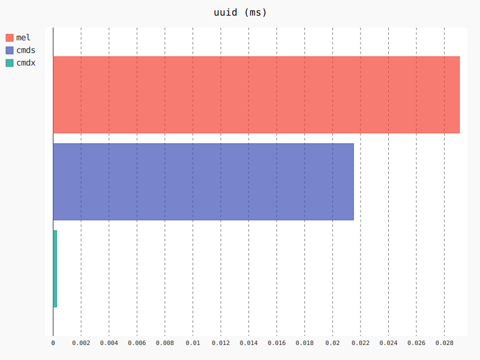

What `maya.cmds` could look like with unique identifiers.

<br>

### About

`cmdx` is a superset of `cmds` that looks and acts like the `cmds`, but utilises the new UUID attribute of Maya 2016 and above to make *exact* (X marks the spot) references to nodes, independent of name and path. Like a faster and leaner PyMEL.

```python
import cmdx

box = cmdx.createNode("transform", name="myBox")
cmdx.rename(box, "yourBox")
child = cmdx.createNode("transform", name="myChild", parent=box)
cmdx.setAttr(box + ".translateX", 5)
group = cmdx.group(empty=True)
cmdx.parent(box, group)
cmdx.delete(box)
```

> Note how renaming and reparenting doesn't break the reference to `box`.

<br>

### Transition

`cmdx` works as a drop-in replacement for `cmds`, meaning you can search-and-replace `cmds` with `cmdx` and expect everything to work alike; if not then that's a bug and you should file [an issue]().

Once you are confident in `cmdx`, you can start improving readability.

**Before**

```python
node = cmds.rename(node, "newName")
```

**After**

```python
cmds.rename(node, "newName")
```

- See [Optimising for Readability](#optimising-for-readability) for more tips and tricks.

<br>

### Interoperability

`cmdx` is designed to work alongside `cmds`, with one caveat; paths are **absolute**, not relative.

For example.

```python
group = cmdx.group(name="group", empty=True)
print(group)
# |group
```

Conversely, `cmds` returns the *shortest* path to any node, which in some cases is the above, in other cases only `group|child` and in others only `child`.

Under the hood, references to each node in `cmdx` is made via a unique identifiers known as a "uuid".

```python
node1 = cmds.createNode("transform", name="node1")
node2 = cmds.createNode("transform", name="node1", parent=node1)

cmds.rename(node1, "node2")
# ERROR: More than one object matches name

node1 = cmdx.createNode("transform", name="node1")
node2 = cmdx.createNode("transform", name="node1", parent=node1)

cmdx.rename(node1, "node2")
# OK
```

This works because the UUID of `node1` is independent of its name and place in the hierarchy.

<br>

### Optimising for Readability

Code is read more often than it is written.

**Before**

```python
node = cmds.createNode("transform", name="myNode")
node = cmds.parent(node, otherNode)
```

**After**

```python
node = cmds.createNode("transform", name="myNode")
cmds.parent(node, otherNode)
```

Readability can be improved further with a little object-oriented syntax sugar.

```python

```

<br>

### Identity

Perhaps the greatest strength of `cmdx` over `cmds` is the relationship between your variable and node.

With `cmds`, nodes are referenced via their relative path at the time of creation.

```python
mynode = cmds.createNode("transform", name="myNode")
cmds.parent(cmds.group(empty=True))
cmds.rename(mynode, "yourNode")
# Error
```

Because the node referenced by the variable `mynode` was re-parented, the link between it and the node is severed. To account for this, the `cmds.parent` command returns an updated reference to the node.

```python
mynode = cmds.createNode("transform", name="myNode")
mynode = cmds.parent(cmds.group(empty=True))
cmds.rename(mynode, "yourNode")
# Success
```

But this does not account for children.

```python
parent = cmds.createNode("transform")
child = cmds.createNode("transform", parent=parent)

parent = cmds.rename(parent, "myParent")
child = cmds.rename(child, "myNode")
# Error
```

Despite our best efforts, the link between `child` and the node is again severed.

### Attribute Query and Assignment

The traditional interface works as you would expect.

```python
transform, generator = cmdx.sphere()
cmdx.setAttr(generator + ".radius", 2)
```

The equivalent extended interface looks like this.

```python
transform, generator = cmdx.sphere()
generator["radius"] = 2
```

Reading an attribute works similarly.

```python
print(cmdx.getAttr(generator + ".subdivisionHeight"))
# 20
print(generator["subdivisionAxis"])
# 20
```

### Connections

Connecting one attribute to another, unsurprisingly, works the way you would expect.

```python
a, b = cmdx.createNode("transform"), cmds.createNode("transform")
cmdx.connectAttr(a + ".translateX", b + ".translateX")
```

With optional object-oriented conveniences.

```python
# Option 1
a["translateX"] >> b["translateX"]

# Option 2
a["translateX"].connect(b["translateX"])
```

```python
group["visibility"] = True
sphere
```

<br>

### Comparison

`cmdx` is a better PyMEL. There are a few thing PyMEL does right, such as the object-oriented interface, the unambiguous reference to nodes

With PyMEL as baseline, these are the primary goals of this project, in order of importance.

- [X] compatibility with maya.cmds
  - PyMEL is an all-or-nothing deal. You either use it everywhere, or not at all. This makes using it for its strengths difficult to impossible, without also suffering from its weaknesses.
  - For adoption, familiarity and ability to swap for `cmds` at any point in time via search-and-replace.
- [X] Faster
  - cmdx is 2-150x faster on average
- [X] PEP08
  - PyMEL is written in a multitude of styles with little to no linting
- [X] No side effects
  - PyMEL changes external function, classes and modules on import; presumably to account for flaws in its own design and the design of the externals. This is both dangerous, unexpected and 
- [X] Customisable
  - PyMEL is bundled with Maya, making it difficult to impossible to expect users to install and maintain their own copy.
  - PyMEL is large and riddled with hacks to account for bugs encountered throughout the years.
  - PyMEL is multi-module, multi-package 
- [X] Single module

<br>

### Performance

All of this convenience would go to waste is `cmdx` was not faster than PyMEL; which already offers many of the same advantages.

Luckily, the performance is far greater.

#### Overall Performance

Shorter is better.


#### import

PyMEL performs a vast number of operations on import. `cmds` is a compiled library that merely points to members internal to Maya, so it isn't accurate to measure the time taken to import it - it's nearly instantaneous. `cmdx` however is a plain Python library that also performs some amount of initialisation yet still fades in comparison to PyMEL.


#### ls

Both PyMEL and `cmdx` wrap results in an object-oriented interface to resulting nodes.


#### createNode


#### getAttr


#### long

Retrieving the long name of any node, e.g. `cmds.ls("node", long=True)`.


#### uuid

PyMEL was unable to retrieve the UUID of a node. `cmdx` operates on UUIDs natively, so retrieving it is instantaneous.



#### node.attr

Both PyMEL and `cmdx` offer convenience facilities for reading and writing attributes.

```python
# cmdx
node["tx"]

# PyMEL
pynode.tx().get()
```


#### Mission

Because references to nodes are exact, the potential for performance is greater than that of `cmds`.