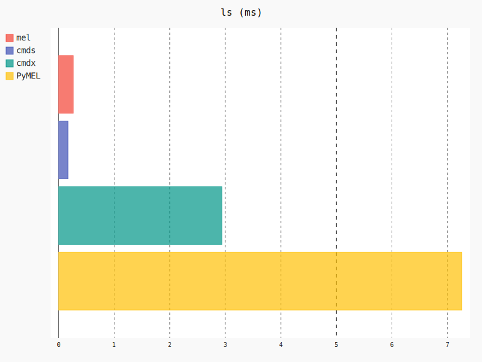

Fast subset of `maya.cmds`

<br>

### About

`cmdx` is a Python wrapper for the [Maya Python API 2.0](http://help.autodesk.com/view/MAYAUL/2016/ENU/?guid=__py_ref_index_html) and a fast subset of the `maya.cmds` module, with persistent references to nodes.

If you fit in either of these groups, then `cmdx` is for you.

- You like `cmds`, but wish to type less
- You like `PyMEL`, but wish it was faster

On average, `cmdx` is **140x faster** than [PyMEL](https://github.com/LumaPictures/pymel), and 2.5x faster than `maya.cmds` at common tasks; at best, it is 1,300x faster than PyMEL.

- See [Measurements](#measurements) and [Timings](#timings) for details
- See [API Documentation]() for usage 

<br>
<br>

**Table of contents**

- [Syntax](#syntax)
- [Performance](#performance)
- [Goals](#goals)
- [Interoperability](#interoperability)
- [Units](#units)
- [Node Creation](#node-creation)
- [Attribute Query and Assignment](#attribute-query-and-assignment)
- [Connections](#connections)
- [FAQ](#faq)
- [Comparison](#comparison)
  - [MEL](#mel)
  - [PyMEL](#pymel)
  - [cmds](#cmds)
  - [API 1.0](#api-1-0)
  - [API 2.0](#api-2-0)
- [YAGNI](#yagni)
- [Timings](#timings)
- [Measurements](#measurements)
  - [Overall Performance](#overall-performance)
  - [`import`](#import)
  - [`createNode`](#createNode)
  - [`getAttr`](#getAttr)
  - [`setAttr`](#setAttr)
  - [`connectAttr`](#connectAttr)
  - [`long`](#long)
  - [`node`](#node-attr-attr)
  - [`ls`](#ls)
- [Evolution](#evolution)
- [References](#references)
- [Notes](#notes)
  - [MDagModifier](#mdagmodifier)

<br>

### Syntax

`cmdx` supports the legacy syntax of `maya.cmds`, along with an object-oriented syntax, similar to PyMEL.


**Legacy**

Familiar and fast.

```python
import cmdx
joe = cmdx.createNode("transform", name="Joe")
benji = cmdx.createNode("transform", name="myChild", parent=joe)
cmdx.addAttr(joe, longName="myAttr", defaultValue=5.0, attributeType="double")
cmdx.connectAttr(joe + ".myAttr", benji + ".tx")
cmdx.setAttr(joe + ".myAttr", 5)
cmdx.delete(joe)
```

**Modern**

Faster and most concise.

```python
import cmdx
joe = cmdx.createNode("transform", name="Joe")
benji = cmdx.createNode("transform", name="myChild", parent=joe)
joe["myAttr"] = cmdx.Double(default=5.0)
joe["myAttr"] >> benji["translateX"]
joe["tx"] = 5
cmdx.delete(joe)
```

**Commands**

- `createNode`
- `getAttr`
- `setAttr`
- `addAttr`
- `connectAttr`
- `listRelatives`
- `listConnections`
- `ls`

**Attribute Types**

- `Double`
- `Double3`
- `Enum`
- `String`
- `Angle`
- `Distance`
- `Time`
- `Message`
- `Boolean`
- `Divider`
- `Long`
- `Compound`

<br>

### Performance

`cmdx` is fast, faster than `cmds` by 2-5x and PyMEL by 5-150x, because of how it uses the Maya API 2.0, how classes are built and the (efficient) pre-processing happening on import.

See [Measurements](#measurements) for performance statistics and comparisons between MEL, cmds, cmdx, PyMEL, API 1.0 and 2.0.

<br>

### Goals

With PyMEL as baseline, these are the primary goals of this project, in order of importance.

| Goal            | Description
|:----------------|:-------------
| Fast            | Faster than PyMEL, and cmds
| Lightweight     | A single Python module, implementing critical parts well, leaving the rest to `cmds`
| Persistent      | References to nodes do not break
| Do not crash    | Working with low-level Maya API calls make it susceptible to crashes; cmdx should protect against this, without sacrificing performance
| External        | Shipped alongside your code, not alongside Maya; you control the version, features and fixes.
| Vendorable      | Embed an appropriate version of `cmdx` alongside your own project
| PEP8            | Continuous integration ensures that every commit follows the consistency of PEP8
| Examples        | No feature is without examples
| No side effects | Importing `cmdx` has no affect any other module

<br>

### Interoperability

`cmdx` complements `cmds`, but does not replace it.

Commands such as `menuItem`, `inViewMessage` and `move` are left out and considered a convenience; not sensitive to performance-critical tasks such as generating nodes, setting or connecting attributes etc.

Hence interoperability looks like this.

```python
import cmdx
from maya import cmds

group = cmds.group(name="group", empty=True)
cmds.move(group, 0, 50, 0)
group = cmdx.encode(group)
group["rotateX", cmdx.Radians] = 3.14
cmds.select(cmdx.decode(group))
```

- See [API Documentation]() for which members are available in `cmdx`
- Submit an [issue](issues) or [pull-request](#fork) with commands you miss

<br>

### Units

`cmdx` takes and returns values in the units used by the UI. For example, Maya's default unit for distances, such as `translateX` is in Centimeters.

```python
import cmdx

node = cmdx.createNode("transform")
node["translateX"] = 5
node["translateX"]
# 5
```

To return `translateX` in Meters, you can pass in a unit explicitly.

```python
node["translateX", cmdx.Meters]
# 0.05
```

To set `translateX` to a value defined in Meters, you can pass that explicitly too.

```python
node["translateX", cmdx.Meters] = 5
```

Or use the alternative syntax.

```python
node["translateX"] = cmdx.Meters(5)
```

The following units are currently supported.

- Angular
  - `Degrees`
  - `Radians`
  - `AngularMinutes`
  - `AngularSeconds`
- Linear
  - `Millimeters`
  - `Centimeters`
  - `Meters`
  - `Kilometers`
  - `Inches`
  - `Feet`
  - `Miles`
  - `Yards`

<br>

### Limitations

All of this performance is great and all, but why hasn't anyone thought of this before? Are there no consequences?

I'm sure someone has, and yes there are.

#### Undo

With every command made through `maya.cmds`, the undo history is populated such that you can undo a *block* of commands all at once. `cmdx` doesn't do this, which makes it faster, but also impossible to undo. Any node created or attribute changed is permanent, which is why it is that much more important that you take care of the creations and changes that you make.

In the future, `cmdx` will expose a context manager to faciliate situations where you are willing to trade the ability to undo for performance.

It may look something like this.

```pytyhon
import cmdx

with cmdx.undoBlock() as block:
  node1 = block.createNode("decomposeMatrix")
  node2 = block.createNode("transform")
  node3 = block.createNode("transform")
  block.connect(node1, node2)
  block.setAttr(node3["tx"], 5)
```

#### Crashes

...

<br>

### Node Creation

Nodes are created much like with `maya.cmds`.

```python
import cmdx
cmdx.createNode("transform")
```

For a 5-10% performance increase, you may pass type as an object rather than string.

```python
cmdx.createNode(cmdx.Transform)
```

Only the most commonly used and performance sensitive types are available as explicit types.

- `AddDoubleLinear` 
- `AddMatrix` 
- `AngleBetween` 
- `MultMatrix` 
- `AngleDimension` 
- `BezierCurve` 
- `BlendShape` 
- `Camera` 
- `Choice` 
- `Chooser` 
- `Condition` 
- `Transform` 
- `TransformGeometry` 
- `WtAddMatrix` 

See [API Documentation]() for more.

<br>

### Attribute Query and Assignment

Attributes are accessed in a dictionary-like fashion.

```python
import cmdx
node = cmdx.createNode("transform")
node["translateX"]
# 0.0
```

Evaluation of an attribute is delayed until the very last minute, which means that if you don't *read* the attribute, then it is only accessed and not evaluated and cast to a Python type.

```python
attr = node["rx"]
```

The resulting type of an attribute is `cmdx.Plug`

```python
type(attr)
# <class 'cmdx.Plug'>
```

Which has a number of additional methods for query and assignment.

```python
attr.read()
# 0.0
attr.write(1.0)
attr.read()
# 1.0
```

`attr.read()` is called when printing an attribute.

```python
print(attr)
# 1.0
```

For familiarity, an attribute may also be accessed by string concatenation.

```python
attr = node + ".tx"
```

<br>

### Compound and Array Attributes

These both have children, and are accessed like a Python list.

```python
node = cmdx.createNode("transform")
decompose = cmdx.createNode("decomposeMatrix")
node["worldMatrix"][0] >> decompose["inputMatrix"]
```

Array attributes are created by an additional argument.

```python
node = cmdx.createNode("transform")
node["myArray"] = cmdx.Double(array=True)
```

Compound attributes are created as a group.

```python
node = cmdx.createNode("transform")
node["myGroup"] = cmdx.Compound(children=(
  cmdx.Double("myGroupX")
  cmdx.Double("myGroupY")
  cmdx.Double("myGroupZ")
))
```

Both array and compound attributes can be written via index or tuple assignment.

```python
node["myArray"] = (5, 5, 5)
node["myArray"][1] = 10
node["myArray"][2]
# 5
```

<br>

### Connections

Connect one attribute to another with one of two syntaxes, whichever one is the most readable.

```python
a, b = map(cmdx.createNode, ("transform", "camera"))

# Option 1
a["translateX"] >> b["translateX"]

# Option 2
a["translateY"].connect(b["translateY"])
```

Legacy syntax is also supported, and is almost as fast - the overhead is one additional call to `str.strip`.

```python
cmdx.connectAttr(a + ".translateX", b + ".translateX")
```

<br>

### FAQ

> Why is it crashing?

`cmdx` should never crash (if it does, please [submit a bug report!]()), but the cost of performance is safety. `maya.cmds` rarely causes a crash because it has safety procedures built in. It double checks to ensure that the object you operate on exists, and if it doesn't provides a safe warning message. This double-checking is part of what makes `maya.cmds` slow; conversely, the lack of it is part of why `cmdx` is so fast.

Common causes of a crash is:

- Use of a node that has been deleted
- ... (add your issue here)

This can happen when, for example, you experiment in the Script Editor, and retain access to nodes created from a different scene, or after the node has simply been deleted.

> Why is PyMEL slow?

...

> Doesn't PyMEL also use the Maya API?

Yes and no. Some functionality, such as [`listRelatives`](https://github.com/LumaPictures/pymel/blob/eb984107952cde052a3ecdb473e66c7db7deb3b7/pymel/core/general.py#L1026) call on `cmds.listRelatives` and later convert the output to instances of `PyNode`. This performs at best as well as `cmds`, with the added overhead of converting the transient path to a `PyNode`.

Other functionality, such as `pymel.core.datatypes.Matrix` wrap the `maya.api.OpenMaya.MMatrix` class and would have come at virtually no cost, had it not inherited 2 additional layers of superclasses and implemented much of the [computationally expensive]() functionality in pure-Python.

<br>

### Comparison

This section explores the relationship between `cmdx` and (1) MEL, (2) cmds, (3) PyMEL and (4) API 1/2.

##### MEL

Maya's Embedded Language (MEL) makes for a compact scene description format.

```python
createNode transform -n "myNode"
	setAttr .tx 12
	setAttr .ty 9
```

On creation, a node is "selected" which is leveraged by subsequent commands, commands that also reference attributes via their "short" name to further reduce file sizes.

A scene description never faces naming or parenting problems the way programmers do. In a scene description, there is no need to rename nor reparent; a node is created either as a child of another, or not. It is given a name, which is unique. No ambiguity.

From there, it was given expressions, functions, branching logic and was made into a scripting language where the standard library is a scene description kit. 

`cmds` is tedious and `pymel` is slow. `cmds` is also a victim of its own success. Like MEL, it works with relative paths and the current selection; this facilitates the compact file format, whereby a node is created, and then any references to this node is implicit in each subsequent line. Long attribute names have a short equivalent and paths need only be given at enough specificity to not be ambiguous given everything else that was previously created. Great for scene a file format, not so great for code that operates on-top of this scene file.

##### PyMEL

PyMEL is 31,000 lines of code, the bulk of which implements backwards compatibility to `maya.cmds` versions of Maya as far back as 2008, the rest reiterates the Maya API.

**Line count**

PyMEL has accumulated a large number of lines throughout the years.

```bash
root@0e540f42ee9d:/# git clone https://github.com/LumaPictures/pymel.git
Cloning into 'pymel'...
remote: Counting objects: 21058, done.
remote: Total 21058 (delta 0), reused 0 (delta 0), pack-reused 21058
Receiving objects: 100% (21058/21058), 193.16 MiB | 15.62 MiB/s, done.
Resolving deltas: 100% (15370/15370), done.
Checking connectivity... done.
root@0e540f42ee9d:/# cd pymel/
root@0e540f42ee9d:/pymel# ls
CHANGELOG.rst  LICENSE  README.md  docs  examples  extras  maintenance  maya  pymel  setup.py  tests
root@0e540f42ee9d:/pymel# cloc pymel/
      77 text files.
      77 unique files.
       8 files ignored.

http://cloc.sourceforge.net v 1.60  T=0.97 s (71.0 files/s, 65293.4 lines/s)
-------------------------------------------------------------------------------
Language                     files          blank        comment           code
-------------------------------------------------------------------------------
Python                          67           9769          22410          31251
DOS Batch                        2              0              0              2
-------------------------------------------------------------------------------
SUM:                            69           9769          22410          31253
-------------------------------------------------------------------------------
```
<br>

### YAGNI

The Maya Ascii file format consists of a limited number of MEL commands that accurately and efficiently reproduce anything you can achieve in Maya. This format consists of primarily 4 commands.

- `createNode`
- `addAttr`
- `setAttr`
- `connectAttr`

You'll notice how there aren't any calls to reparent, rename otherwise readjust created nodes. Nor are there high-level commands such as `cmds.polySphere` or `cmds.move`. These 4 commands is all there is to represent the entirety of the Maya scenegraph; including complex rigs, ugly hacks and workarounds by inexperienced and seasoned artists alike.

The members of `cmdx` is a reflection of this simplicity.

However, convenience members make for more readable and maintainable code, so a balance must be struck between minimalism and readability. This balance is captured in `cmdx.encode` and `cmdx.decode` which acts as a bridge between `cmds` and `cmdx`. Used effectively, you should see little to no performance impact when performing bulk-operations with `cmdx` and passing the resulting nodes as transient paths to `cmds.`

<br>

### Timings

`cmdx` is on average `142.89x` faster than `PyMEL` on these common tasks.

|         | Times        | Task
|:--------|:-------------|:------------
| cmdx is | 2.2x faster  | addAttr
| cmdx is | 4.9x faster  | setAttr
| cmdx is | 7.5x faster  | createNode
| cmdx is | 2.6x faster  | connectAttr
| cmdx is | 50.9x faster | long
| cmdx is | 16.6x faster | getAttr
| cmdx is | 19.0x faster | node.attr
| cmdx is | 11.3x faster | node.attr=5
| cmdx is | 1285.6x faster | import
| cmdx is | 148.7x faster | listRelatives
| cmdx is | 22.6x faster | ls

`cmdx` is on average `2.53x` faster than `cmds` on these common tasks.

|         | Times       | Task
|:--------|:------------|:------------
| cmdx is | 1.4x faster | addAttr
| cmdx is | 2.3x faster | setAttr
| cmdx is | 4.8x faster | createNode
| cmdx is | 2.1x faster | connectAttr
| cmdx is | 8.0x faster | long
| cmdx is | 1.8x faster | getAttr
| cmdx is | 0.0x faster | import
| cmdx is | 1.8x faster | listRelatives
| cmdx is | 0.5x faster | ls

> Run `plot.py` to reproduce these numbers.

<br>

### Measurements

Below is a performance comparisons between the available methods of manipulating the Maya scene graph.

- `MEL`
- `cmds`
- `cmdx`
- `PyMEL`
- `API 1.0`
- `API 2.0`

Surprisingly, `MEL` is typically outdone by `cmds`. Unsurprisingly, `PyMEL` performs on average 10x slower than `cmds`, whereas `cmdx` performs on average 5x faster than `cmds`.

<br>

#### Overall Performance

Shorter is better.


#### import

Both `cmdx` and PyMEL perform some amount of preprocessing on import.


#### createNode


#### getAttr


#### setAttr


#### connectAttr


#### long

Retrieving the long name of any node, e.g. `cmds.ls("node", long=True)`.


#### node.attr

Both `cmdx` and PyMEL offer an object-oriented interface for reading and writing attributes.

```python
# cmdx
node["tx"].read()
node["tx"].write(5)

# PyMEL
pynode.tx().get()
pynode.tx().set(5)
```


#### ls

Both `cmdx` and PyMEL wrap results in an object-oriented interface to resulting nodes.

This one is great, as it tests the `__init__` of the internal class used to encapsulate a Maya node.



<br>

### Evolution

`cmdx` started as a wrapper for `cmds` where instead of returning a transient path to nodes, it returned the new UUID attribute of Maya 2016 and newer. The benefit was immediate; no longer had I to worry about whether references to any node was stale. But it impacted negatively on performance. It was effectively limited to the performance of `cmds` plus the overhead of converting to/from the UUID of each absolute path.

The next hard decision was to pivot from being a superset of `cmds` to a subset; to rather than wrapping the entirety of `cmds` instead support a minimal set of functionality. The benefit of which is that more development and optimisation effort is spent on less functionality.

<br>

### References

These are some of the resources used to create this project.

- http://austinjbaker.com/mplugs-setting-values
- https://nccastaff.bournemouth.ac.uk/jmacey/RobTheBloke/www/mayaapi.html

<br>

### Notes

Additional thoughts.

#### MDagModifier

`createNode` of `OpenMaya.MDagModifier` is ~20% faster than `cmdx.createNode` *excluding* load. Including load is 5% *slower* than `cmdx`. 

```python
from maya.api import OpenMaya as om

mod = om.MDagModifier()

def prepare():
    New()
    for i in range(10):
        mobj = mod.createNode(cmdx.Transform)
        mod.renameNode(mobj, "node%d" % i)

def createManyExclusive():
    mod.doIt()


def createManyInclusive():
    mod = om.MDagModifier()

    for i in range(10):
        mobj = mod.createNode(cmdx.Transform)
        mod.renameNode(mobj, "node%d" % i)

    mod.doIt()

def createMany(number=10):
    for i in range(number):
        cmdx.createNode(cmdx.Transform, name="node%d" % i)

Test("API 2.0", "createNodeBulkInclusive", createManyInclusive, number=1, repeat=100, setup=New)
Test("API 2.0", "createNodeBulkExclusive", createManyExclusive, number=1, repeat=100, setup=prepare)
Test("cmdx", "createNodeBulk", createMany, number=1, repeat=100, setup=New)

# createNodeBulkInclusive API 2.0: 145.2 ms (627.39 µs/call)
# createNodeBulkExclusive API 2.0: 132.8 ms (509.58 µs/call)
# createNodeBulk cmdx: 150.5 ms (620.12 µs/call)
```

<br>

### Contributing

Dealing with Maya version incompatibilities is done by falling back to `cmds` where relevant. There will be a performance hit, but MUST be functionally identical.

**Example**

```python
def descendents(self):
  if __maya_version__ <= 2015:
    # use maya.cmds functionality
  else:
    # use API 2.0
```
